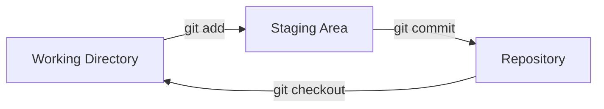

## Step 2: Creating Your First Repository

Now that we are familiar with the sample project and informed Git who we are, let's get our game into version control!

### 📖 Theory: The Git Workflow

The Git workflow involves three main areas:

- **Working Directory**: Your project files where you are making changes.
- **Staging Area (Index)**: A preparation area for grouping changes you want to save to history.
- **Repository**: The permanent records of your project's development history.



### What are the important Git commands?

Git has many operations, but there are a few you will use the most for local projects.

- `git init` - Start a new repository to enable versioning.
- `git add` - Group related changes together in the staging area, in preparation to "commit" them to history.
- `git commit` - Save or "commit" the changes in the staging area to the project's history.
  - commit message - A short description of the changes to help keep the history organized.
- `git status` - View the current state of your working directory and staging area.
- `git checkout` - Change your working directory to a different version from the repository history.

> [!TIP]
> Don't undervalue the commit message! A clear, concise, descriptive, and non-generic message will make your project history much easier to understand (and help find those future bugs)!

### ⌨️ Activity 1: Initialize a project repository (using the CLI)

Let's add version control to our game and commit the current version.

1. In the terminal, navigate to the project directory.

   ```bash
   cd /workspaces/stack-overflown
   ```

1. Initialize a new Git repository.

   ```bash
   git init
   ```

1. Check repository status. Notice it says "No commits yet" and the tip to use `git add`.

   ```bash
   git status
   ```

   

1. Promote the game files to the staging area. This will create a locked copy, preparing them for committing to the repository history.

   ```bash
   git add src/index.html
   git add src/index.js
   git add src/patterns.js
   git add src/style.css
   ```

   or

   ```bash
   git add src/*
   ```

1. Check the repository status again. Notice that each file is identified as `new file`.

   ```bash
   git status
   ```

   

1. Commit the changes to the repository history. Our project history is now started! :octocat:

   ```bash
   git commit -m "Initial commit"
   ```

   

1. Check repository status. Notice the "working tree clean" which means our current copy perfectly matches the history.

   ```bash
   git status
   ```

   

### ⌨️ Activity 2: Work on a file (using VS Code)

Let's also try adding files with our code editor, in this case the documentation for our game.

1. In the file explorer, click the **New File...** icon to start a README file with the following name. Make sure it is inside the `src/stack-overflown/` folder.

   ```txt
   README.md
   ```

   

1. Open the file and insert the following content.

   ```md
   # Stack Overflown

   Organize the falling blocks into the current debug pattern before the stack overflows! ⏳
   ```

1. In the left navigation, select the **Source Control** tab. Notice the `README.md` file is listed under the **Changes** area.

   

1. Promote the file to the staging staging area by hovering over file and selecting the plus sign `+` button.

   

1. Enter a commit message and press the **Commit** button.

   ```txt
   Start game documentation
   ```

   

1. For a second commit, also add the following content to `README.md`.

   ```md
   ## How to Develop

   - `index.html` - the game container for playing
   - `index.js` - the primary game logic
   - `patterns.js` - the error patterns to match during gameplay
   - `style.css` - the game formatting and styling
   ```

1. Promote the change to staging and commit with the below message.

   ```txt
   Start developer docs
   ```

   

1. With your new commits added to the repository, Mona should already be busy checking your work. Give her a moment and keep watch in the comments. You will see her respond with progress info and the next steps.

<details>
<summary>Having trouble? 🤷</summary><br/>

- If `git status` shows the wrong files, you can remove them from staging with `git restore --staged <filename>`

</details>
