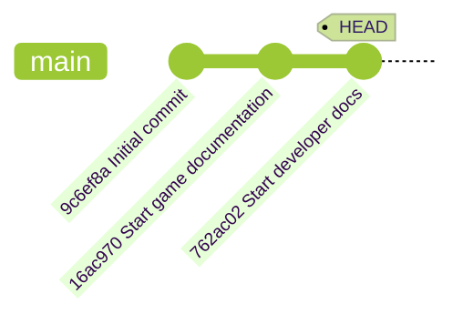

## Step 3: Exploring Git History

With our game now tracked in Git, let's learn how to explore what changes were made, when they were made, and by whom.

### 📖 Theory: Understanding Git History

Git maintains a complete history of your project through commits. Each commit contains:

- **Unique hash ID**: A unique identifier to easily reference it in the history.
- **Parent commit**: Reference to the previous commit, creating a chain.
- **Author information**: Who made the changes.
- **Timestamp**: When the changes were applied.
- **Commit message**: Description of the changes included in that commit.

Additionally, the `HEAD` pointer is a special label that indicates your current position in the project history. Your project probably looks similar to the below diagram.



### What are the important Git commands?

Everyone prefers viewing the history in different ways, and the community has created many options.
Here are a few of the common commands and options you will often use.

- `git log` - Display a detailed history of the project.
  - `git log --oneline` - Show one commit per line, but with less detail.
  - `git log --graph` - Show a visual diagram, useful for diverging paths.
- `git checkout` - Move to a different point in the history (modifies files in your working directory).

### ⌨️ Activity 1: Explore the history (using the CLI)

1. Show the detailed commit history.

   ```bash
   git log
   ```

   

1. Show one commit per line.

   ```bash
   git log --oneline
   ```

   

1. Show a visual graph of the full commit history.

   ```bash
   git log --graph --oneline
   ```

   > 🪧 **Note**: This will look more interesting in a future step when the history is longer.

1. Copy the **Commit ID** of the `Initial commit` entry. Both the long and short form will work.

1. Use it to checkout the earlier version.

   ```bash
   git checkout <commit id>
   ```

   <br/>

   🪧 Notice the `README.md` file was removed.
   
   

1. Return to the latest commit on `main`. Notice the `README.md` file has returned. 🧐

   ```bash
   git checkout main
   ```

   <br/>

   

### ⌨️ Activity 2: Explore the history (using VS Code)

1. In the left navigation, open the **Source Control** tab.

1. Right-click on the **Changes** header and enable the **Graph** option.

   

1. Inspect the **Graph** panel. Notice the timeline list of your recent commits.

   <br/>

1. Click the commit names to expand a list of the files modified by that commit.

   

1. With your exploration of the Git history finished, Mona should already be busy checking your work. Give her a moment and keep watch in the comments. You will see her respond with progress info and the next steps.

<details>
<summary>Having trouble? 🤷</summary><br/>

- Use `git log --help` to see all available options for viewing history.

</details>
