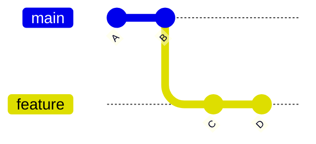
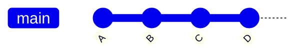
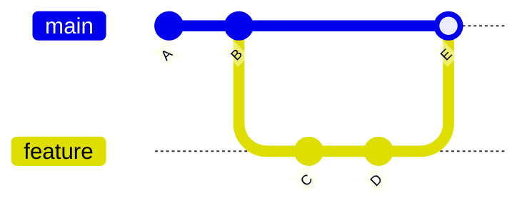
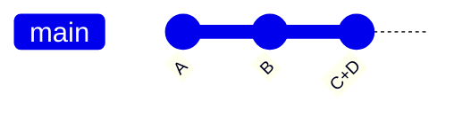

## Step 5: Working with Branches

With our game now tracked, we know it is easy to return to a working version. And since we can see the exact changes we are committing to history, we know nothing unrelated will be included.

But now, that brings up more questions! 😱

"How do I prevent a messy history?"

"How do I avoid non-working versions in the history from incomplete work?"

"What if I need to work on multiple features/fixes at the same time?"

### 📖 Theory: Understanding Branches

Branches in Git are lightweight pointers (like labels) to specific commits. This allows working on a dependent version without influencing the original, which is great for parallel feature development and collaboration.

Key Concepts:

- **`main` Branch**: Usually the trusted working version, and the first branch. (historically called `master`)
- **Feature Branch**: A safe isolated space to develop without affecting the trusted version.
- **Merging**: Combining changes from different branches.

### How do you combine branches?

There are multiple strategies for organizing commits. Usually, all in the name of different styles of organization, transparency, and traceability. Let's introduce the most common.

**Fast-forward merge**: Move the new commits from the child branch onto the parent branch.

<div align="center">

**Before:** Original



**After:** Fast Forward Merge



</div>

**Merge commit**: Apply the changes as a single new commit on the parent branch. Leave the child branch in the network for traceability.

<div align="center">

**Before:** Original


**After:** Merge Commit



</div>

**Squash merge**: Collapse the commits from one branch into a single new commit on the other branch.

<div align="center">

**Before:** Original


**After:** Squash Commit



</div>

### What are the important Git commands?

- `git branch my-new-feature` - Start a branch from the current branch.
- `git checkout my-new-feature` - Change your working directory to a different version from the repository history.
- `git merge` - Apply the commits from one branch onto another branch. (Default: Fast forward merge)

<!-- > [!TIP]
> You can perform a simple "undo" of the last commit with `git reset --soft HEAD~1`. For VS Code, use the Command Palette and search for `Undo Last Commit`. -->

> [!TIP]
> Git 2.23 introduced the `git switch` command to simplify branch management. You will likely see it referenced more in the future.

<!-- Since Git 2.23 -->
<!-- `git switch --create <branch name>` -->
<!-- `git switch branch-name` -->

### ⌨️ Activity 1: Commit to a branch (using the CLI)

Let's start a branch and practice committing changes to it.

1. Before we start, let's see what our history looks like. Notice that it is perfectly linear (no branches yet).

   ```bash
   git log --all --graph --oneline
   ```

   

1. Create a new branch and switch to it.

   ```bash
   git branch fix-incomplete-high-score
   git checkout fix-incomplete-high-score
   ```

1. Show a list of the available branches.

   ```bash
   git branch --list
   ```

   

1. Open `index.js` so we can fix the high score feature.

1. On `line 41`, insert a variable for high score and then commit it.

   ```js
   let highScore = 0;
   ```

   ```bash
   git add src/index.js
   git commit -m "Add new variable for tracking high score"
   ```

1. On `line 61`, insert code to load the score from local storage and then commit it.

   ```js
   // Load high score from localStorage
   highScore = parseInt(localStorage.getItem("stackOverflownHighScore")) || 0;
   document.getElementById("high-score").textContent = highScore;
   ```

   ```bash
   git add src/index.js
   git commit -m "Add loading of stored high score"
   ```

1. On `line 313` replace the `updateScore` function so it tracks the highest score, then commit it.

   ```js
   function updateScore() {
     document.getElementById("score").textContent = score;

     // Update high score if current score exceeds it
     if (score > highScore) {
       highScore = score;
       document.getElementById("high-score").textContent = highScore;
       localStorage.setItem("stackOverflownHighScore", highScore);
     }
   }
   ```

   ```bash
   git add src/index.js
   git commit -m "Add logic to keep track of highest score"
   ```

1. Let's look at the history graph again. Notice our feature branch has 3 more commits than the `main` branch, and that our feature branch is marked with `HEAD` clarifying our current version.

   ```bash
   git log --all --graph --oneline
   ```

   

1. Switch back to the `main` branch.

   ```bash
   git checkout main
   ```

1. Merge the new feature.

   > 🪧 **Note:** For learning, we use the "not fast forward" option so the branch stays visible in the history. It will make our visual diagram more interesting to look at.

   ```bash
   git merge --no-ff fix-incomplete-high-score -m "Fix high score tracker"
   ```

   

1. Let's look at the history graph again. Notice the parallel branch that is now merged.

   ```bash
   git log --all --graph --oneline
   ```

   

1. Remove the pointer/label to the feature branch, since it is now merged and no longer needed.

   ```bash
   git branch --delete fix-incomplete-high-score
   ```

   > 🪧 **Note**: This does not delete the branch content, just the name used for referencing it.

### ⌨️ Activity 2: Commit to a branch (using VS Code)

1. In the left navigation, open the **Source Control** tab. Make sure the **Graph** panel is still visible (from step 3). Let's watch it update as we apply changes.

1. In the lower status bar on the left, click the branch name `main`. A menu will appear with options.

   <br/>

1. Select the **Create new branch...** option and use the below name.

   

   ```txt
   add-level-counter
   ```

   

1. Open `index.html`. On `line 21`, insert a new element for showing the current level, then commit the change.

   ```diff
   <h3>Level</h3>
   <div class="score" id="level">1</div>
   ```

   Commit message

   ```bash
   Add element to display current level
   ```

1. Open `index.js` so we can add the level counter.

1. On `line 42`, add 2 variables for tracking level, then commit the change.

   ```js
   let level = 1;
   let patternsCleared = 0;
   ```

   Commit Message

   ```bash
   Add variables for level and clear counter
   ```

1. On `line 273`, replace the `checkPatternMatch` method with the following, then commit the change.

   ```js
   function checkPatternMatch() {
     for (let startRow = 0; startRow <= ROWS - PATTERN_SIZE; startRow++) {
       for (let startCol = 0; startCol <= COLS - PATTERN_SIZE; startCol++) {
         if (matchesPattern(startRow, startCol)) {
           clearPattern(startRow, startCol);
           score += 100;
           patternsCleared++;
           if (patternsCleared % 5 === 0) {
             level++;
             dropInterval = Math.max(200, 1000 - (level - 1) * 100);
             document.getElementById("level").textContent = level;
           }
           updateScore();
           setNewTargetPattern();
           return;
         }
       }
     }
   }
   ```

   Commit Message

   ```bash
   Add logic to calculate level
   ```

1. Notice the **Graph** panel shows the entire history: the new commits, the previous branch, and also the original commits.

   

1. To prepare for merging, click the branch name again and select the `main` branch.

   <br/>

   

1. Click the three dot menu (`...`), then `Branch`, and select `Merge...`. Notice it performed a normal **Fast Forward** style merge.

   <br/>

   <br/>

   

1. Click the three dot menu (`...`), then `Branch`, and select `Delete Branch...`.

   <br/>

   

1. With both branches merged, Mona should already be busy checking your work. Give her a moment and keep watch in the comments. You will see her respond with progress info and the next steps.

<details>
<summary>Having trouble? 🤷</summary><br/>

- If you made a typo in your branch name, you can rename it with `git branch --move old-name new-name`

</details>
